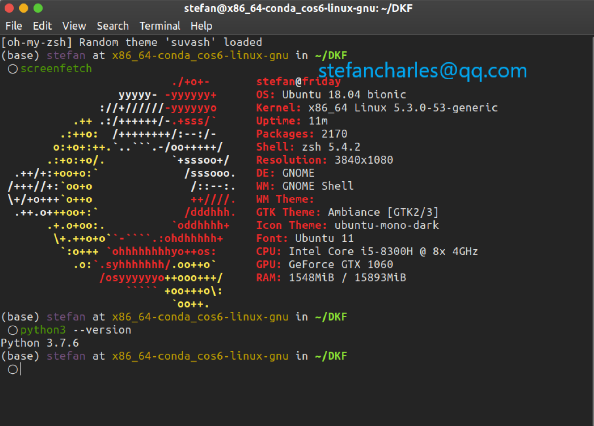
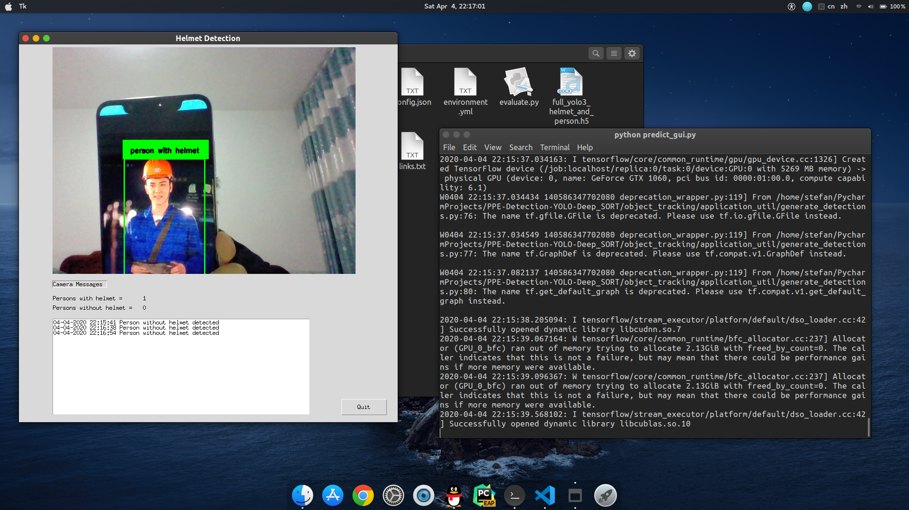

# PPE Detection System

## 背景介绍
在历年逐增工业生产事故中，人的不安全行为是造成事故的直接原因。分析2017年全国安全生产数据，发现生产安全事故中95%的原因是作业人员的不安全行为所导致，如越权限进入工作场所、违章操作、未正确穿戴劳保用品、操作失误或忽视安全警告等行为。而随着人工智能的快速发展，利用机器视觉实现安全检测是当下迫切需求的。本项目主要针对生产环境的安全行为，通过摄像头采集并识别职工在生产车间是否佩戴安全帽的图像数据，从而开发一个能够部署到上位机的车间安全帽检测系统,实现生产环境安全帽佩戴情况的实时检测。

In the successive years of increasing industrial production accidents, human unsafe behavior is the direct cause of the accidents. Analyzing the national safety production data in 2017, it was found that 95% of the production safety accidents were caused by the unsafe behavior of the operating personnel, such as overstepping the authority to enter the workplace, illegal operation, not wearing the correct labor protection equipment, operating errors or ignoring safety warnings and other behaviors. And with the rapid development of artificial intelligence, the use of machine vision to achieve safety detection is the urgent need of the day. This project mainly focuses on the safety behavior in the production environment, through the camera to collect and identify whether employees in the production workshop wearing helmets image data, so as to develop a workshop helmet detection system that can be deployed to the host computer, to achieve real-time detection of the helmet wearing situation in the production environment.

## 开发环境



我的开发和运行环境如上图所示。**注意：我没有在Windows下进行测试。**

My development and running environment is shown above. **Note: I did not test under Windows OS. **

## 实际演示

### 视频

[点击这里去我的B站查看演示](https://www.bilibili.com/video/BV1Di4y1s7Ce)

PS：欢迎关注我的B站账号Stefan，你的三连支持是我更新的动力！

### 截图



## 目前进度

* 实时检测
* 检测佩戴安全帽的人和未佩戴安全帽的人
* 给出标记和日志

----

* Real-time Detection
* Detecting helmet wearers and non-helmet wearers
* Tagging and logging

## 目标计划

* 改进UI
* 改进速度
* 对未佩戴安全帽的人进行远程提醒
* 改进模型

由于目前本人有其他事情，本项目大概会被搁置很长一段时间。如果屏幕面前的你有兴趣改进，欢迎提交改进代码。如果你运行目前的代码有问题，可以尝试联系stefancharles@qq.com，我应该会在我方便的时候给与一定回复。当然，请尽量自己解决问题。

----

* Improve UI
* Improve speed
* Remote reminding for people not wearing helmets
* Improve Model

Due to my other commitments at the moment, this project will probably be on hold for a long time. If you in front of the screen are interested in improving it, you are welcomed to submit improved code. If you're having trouble running the current code, you may try to contact me (stefancharles@qq.com) , and I should be able to respond in some way at my convenience. Of course, please try to solve the problem yourself.

## 运行demo前的准备工作

* 推荐使用conda环境，当然你也可以按你的爱好来
* 推荐使用Linux环境，如果其他系统请自行解决运行问题
* 务必下载必要文件：[点击这里下载mars-small128.pb](https://www.yun.cn/s/7c403eaf5f774ae1baaf75e77e85b9de)

这是表观特征文件，用于跟踪时做特征匹配。**务必下载后放在项目根目录！**

你将还需要一个模型，我这里提供一个已经训练好的模型供你非商业使用，如果你要想识别你自己的指定物体，请务必自己训练模型。

[点击这里去下载检测模型](https://www.yun.cn/s/b1f591f07279407a9e752f9feb9105aa)

----

* Recommended conda environment, although you can use others if you like.
* Recommended for Linux environment, if other systems, please resolve operational issues yourself
* It is essential to download the necessary files:  [Click here to download mars-small128.pb](https://www.yun.cn/s/7c403eaf5f774ae1baaf75e77e85b9de).

This is the apparent feature file, used to do feature matching when tracking.  **Make sure to download it and put it in the root of the project!**

You will also need a model, I am providing a trained model here for your non-commercial use, be sure to train the model yourself if you want to identify your own specified object.

[Click here to go download the detection model](https://www.yun.cn/s/b1f591f07279407a9e752f9feb9105aa)

## 运行demo

1.创建要求的conda环境

```bash
conda create --name helmet-detection --file requirements.txt
```

或者：

```bash
 conda env create -f environment.yml
```

2.激活conda环境

```bash
conda activate helmet-detection
```

3.运行带UI界面的demo

```bash
python predict_gui.py
```

## 训练你自己的模型

1.首先需要一定量的照片，然后对照片进行标记，这些就不赘述了，训练的基本操作。

2.文件夹说明：

* train_image_folder <= the folder that contains the train images.
* train_annot_folder <= the folder that contains the train annotations in VOC format.
* valid_image_folder <= the folder that contains the validation images.
* valid_annot_folder <= the folder that contains the validation annotations in VOC format.

以上文件夹都应放在项目根目录下，请不要修改文件夹名字，如果改的话，请在代码对应位置都进行修改！

3.编辑配置文件

配置文件是json形式：请按你的实际情况进行修改

```json
{
  "model" : {
    "min_input_size":       288,
    "max_input_size":       448,
    "anchors":              [33,34, 52,218, 55,67, 92,306, 96,88, 118,158, 153,347, 209,182, 266,359],
    "labels":               ["helmet","person with helmet","person without helmet"]
  },

  "train": {
    "train_image_folder":   "train_image_folder/",
    "train_annot_folder":   "train_annot_folder/",
    "cache_name":           "helmet_train.pkl",

    "train_times":          8,
    "batch_size":           8,
    "learning_rate":        1e-4,
    "nb_epochs":            100,
    "warmup_epochs":        3,
    "ignore_thresh":        0.5,
    "gpus":                 "0,1",

    "grid_scales":          [1,1,1],
    "obj_scale":            5,
    "noobj_scale":          1,
    "xywh_scale":           1,


    "tensorboard_dir":      "logs",
    "saved_weights_name":   "full_yolo3_helmet_and_person.h5",
    "debug":                true
  },

  "valid": {
    "valid_image_folder":   "",
    "valid_annot_folder":   "",
    "cache_name":           "",

    "valid_times":          1
  }
}
```

4.下载预训练权重文件

**这些权重必须放在项目的根文件夹中。用于后端的预训练权重，将在创建模型时加载。**

[点击这里去下载](https://www.yun.cn/s/fb0de92678a2442c990f5ee8e5025741)

5.（可选）生成数据集的anchors

`python gen_anchors.py -c config.json`

6.开始训练

`python train.py -c config.json`

训练好后你知道你该做啥了。

## 联系方式

stefancharles@qq.com，我也有我自己的事情，有空的话我会回复邮件。

我的个人博客：https://stefancharles.cn/

我的B站主页：https://space.bilibili.com/369436058

## 致谢

本项目代码参考了很多其他大神的开源代码，这里贴出一部分地址：

* [rekon/keras-yolo2](https://github.com/rekon/keras-yolo2) for training data.
* [experiencor/keras-yolo3](https://github.com/experiencor/keras-yolo3) for YOLO v3 implementation.
* [nwojke/deep_sort](https://github.com/nwojke/deep_sort) for Deep_SORT implementation.
